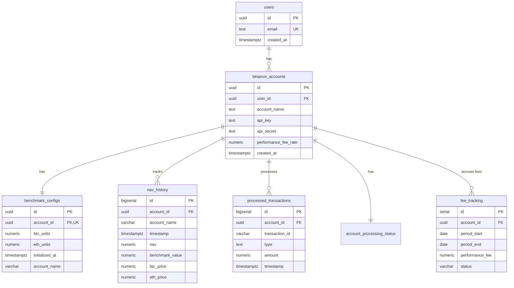

# Database Schema Documentation

This document provides a comprehensive overview of the database schema for the Binance Portfolio Monitor system.

## Overview

The database is hosted on Supabase (PostgreSQL) and consists of:
- **10 main tables** that track cryptocurrency trading performance, benchmark comparisons, and system operations
- **3 views** for performance calculations and analytics
- **6 functions** for business logic and maintenance
- **4 triggers** for automated data population

## Tables

### 1. users
Stores user authentication data.

| Column | Type | Constraints | Description |
|--------|------|-------------|-------------|
| id | UUID | PRIMARY KEY, DEFAULT gen_random_uuid() | Unique user identifier |
| email | TEXT | NOT NULL, UNIQUE | User email address |
| created_at | TIMESTAMPTZ | DEFAULT NOW() | Account creation timestamp |

### 2. binance_accounts
Stores Binance API credentials and account information.

| Column | Type | Constraints | Description |
|--------|------|-------------|-------------|
| id | UUID | PRIMARY KEY, DEFAULT gen_random_uuid() | Unique account identifier |
| user_id | UUID | FOREIGN KEY → users(id) | Reference to user |
| account_name | TEXT | NOT NULL | Display name for the account |
| api_key | TEXT | NOT NULL | Binance API key |
| api_secret | TEXT | NOT NULL | Binance API secret (encrypted) |
| created_at | TIMESTAMPTZ | DEFAULT NOW() | Account creation timestamp |
| performance_fee_rate | NUMERIC(5,4) | DEFAULT 0.50, CHECK (0-1) | Performance fee rate (0.50 = 50%) |

**Indexes:**
- PRIMARY KEY on id
- FOREIGN KEY constraint on user_id

### 3. benchmark_configs
Tracks BTC/ETH units per account and rebalancing configuration.

| Column | Type | Constraints | Description |
|--------|------|-------------|-------------|
| id | UUID | PRIMARY KEY, DEFAULT gen_random_uuid() | Unique config identifier |
| account_id | UUID | FOREIGN KEY → binance_accounts(id), UNIQUE | One config per account |
| btc_units | NUMERIC | DEFAULT 0 | Current BTC holdings in benchmark |
| eth_units | NUMERIC | DEFAULT 0 | Current ETH holdings in benchmark |
| next_rebalance_timestamp | TIMESTAMPTZ | | Next scheduled rebalance time |
| rebalance_day | INTEGER | NOT NULL, DEFAULT 0 | Day of week for rebalancing (0=Monday) |
| rebalance_hour | INTEGER | NOT NULL, DEFAULT 17 | Hour for rebalancing (UTC) |
| last_transaction_check_timestamp | TIMESTAMPTZ | DEFAULT NOW() | Last transaction check time |
| updated_at | TIMESTAMPTZ | DEFAULT NOW() | Last update timestamp |
| account_name | VARCHAR(255) | | Cached account name (auto-populated via trigger) |
| last_rebalance_timestamp | TIMESTAMPTZ | | When last rebalancing occurred |
| last_rebalance_status | VARCHAR(20) | CHECK IN ('pending','success','failed','skipped') | Status of last rebalance |
| last_rebalance_error | TEXT | | Error message if rebalance failed |
| rebalance_count | INTEGER | DEFAULT 0 | Total number of rebalances |
| last_rebalance_btc_units | NUMERIC | | BTC units before last rebalance |
| last_rebalance_eth_units | NUMERIC | | ETH units before last rebalance |
| initialized_at | TIMESTAMPTZ | | Benchmark initialization timestamp |

**Triggers:**
- `benchmark_configs_account_name_trigger` - Populates account_name on INSERT/UPDATE

### 4. nav_history
Stores hourly NAV and benchmark values for each account.

| Column | Type | Constraints | Description |
|--------|------|-------------|-------------|
| id | BIGSERIAL | PRIMARY KEY | Auto-incrementing ID |
| account_name | VARCHAR(255) | | Cached account name (auto-populated via trigger) |
| account_id | UUID | NOT NULL, FOREIGN KEY → binance_accounts(id) | Account reference |
| timestamp | TIMESTAMPTZ | NOT NULL, DEFAULT NOW() | Data collection time |
| nav | NUMERIC(20,2) | NOT NULL | Net Asset Value in USDT |
| benchmark_value | NUMERIC(20,2) | NOT NULL | Benchmark value in USDT |
| btc_price | NUMERIC | | BTC price at timestamp |
| eth_price | NUMERIC | | ETH price at timestamp |
| created_at | TIMESTAMPTZ | NOT NULL, DEFAULT NOW() | Record creation time |

**Indexes:**
- idx_nav_history_account_id
- idx_nav_history_timestamp
- idx_nav_history_account_timestamp

**Triggers:**
- `nav_history_account_name_trigger` - Populates account_name on INSERT

### 5. processed_transactions
Tracks all processed deposit/withdrawal transactions including fee collections.

| Column | Type | Constraints | Description |
|--------|------|-------------|-------------|
| id | BIGSERIAL | PRIMARY KEY | Auto-incrementing ID |
| account_id | UUID | NOT NULL, FOREIGN KEY → binance_accounts(id) | Account reference |
| transaction_id | VARCHAR(255) | NOT NULL | Binance transaction ID |
| type | TEXT | NOT NULL, CHECK IN ('DEPOSIT','WITHDRAWAL','PAY_DEPOSIT','PAY_WITHDRAWAL','FEE_WITHDRAWAL') | Transaction type |
| amount | NUMERIC(20,8) | NOT NULL | Transaction amount |
| timestamp | TIMESTAMPTZ | NOT NULL | Transaction timestamp |
| status | VARCHAR(20) | NOT NULL | Transaction status |
| metadata | JSONB | | Additional data - see Metadata Structure section below |
| created_at | TIMESTAMPTZ | NOT NULL, DEFAULT NOW() | Record creation time |

**Constraints:**
- UNIQUE(account_id, transaction_id) - Prevents duplicate processing
- CHECK constraint on type field

**Indexes:**
- idx_processed_transactions_account_id
- idx_processed_transactions_timestamp
- idx_processed_transactions_transaction_id
- idx_processed_transactions_type

### 6. fee_tracking
Tracks monthly fee accruals and collections for each account.

| Column | Type | Constraints | Description |
|--------|------|-------------|-------------|
| id | SERIAL | PRIMARY KEY | Auto-incrementing ID |
| account_id | UUID | NOT NULL, FOREIGN KEY → binance_accounts(id) | Account reference |
| period_start | DATE | NOT NULL | Start of fee period |
| period_end | DATE | NOT NULL | End of fee period |
| avg_nav | NUMERIC(20,8) | | Average NAV for the period |
| starting_nav | NUMERIC(20,8) | | NAV at period start |
| ending_nav | NUMERIC(20,8) | | NAV at period end |
| starting_hwm | NUMERIC(20,8) | | High Water Mark at period start |
| ending_hwm | NUMERIC(20,8) | | High Water Mark at period end |
| portfolio_twr | NUMERIC(10,6) | | Portfolio Time-Weighted Return |
| benchmark_twr | NUMERIC(10,6) | | Benchmark Time-Weighted Return |
| alpha_pct | NUMERIC(10,6) | | Alpha (portfolio TWR - benchmark TWR) |
| performance_fee | NUMERIC(20,8) | NOT NULL, DEFAULT 0 | Calculated performance fee |
| status | VARCHAR(20) | DEFAULT 'ACCRUED', CHECK IN ('ACCRUED','COLLECTED','WAIVED') | Fee status |
| collected_at | TIMESTAMPTZ | | When fee was collected |
| collection_tx_id | VARCHAR(100) | | Transaction ID of fee collection |
| notes | TEXT | | Additional notes |
| created_at | TIMESTAMPTZ | DEFAULT NOW() | Record creation time |
| updated_at | TIMESTAMPTZ | DEFAULT NOW() | Last update time |

**Constraints:**
- UNIQUE(account_id, period_start) - One fee record per account per period
- CHECK constraint on status field

**Indexes:**
- idx_fee_tracking_account_period ON (account_id, period_start DESC)
- idx_fee_tracking_status ON (status) WHERE status = 'ACCRUED'

**Triggers:**
- `update_fee_tracking_updated_at` - Updates updated_at on UPDATE

### 7. account_processing_status
Tracks the last processed timestamp for each account.

| Column | Type | Constraints | Description |
|--------|------|-------------|-------------|
| account_id | UUID | PRIMARY KEY, FOREIGN KEY → binance_accounts(id) | Account reference |
| last_processed_timestamp | TIMESTAMPTZ | NOT NULL | Last processed transaction time |
| updated_at | TIMESTAMPTZ | DEFAULT NOW() | Last update time |

**Indexes:**
- idx_account_processing_status_account_id
- idx_account_processing_status_updated_at

### 8. price_history
Historical BTC and ETH prices for benchmark calculations.

| Column | Type | Constraints | Description |
|--------|------|-------------|-------------|
| id | BIGSERIAL | PRIMARY KEY | Auto-incrementing ID |
| timestamp | TIMESTAMPTZ | NOT NULL, DEFAULT NOW() | Price capture time |
| btc_price | NUMERIC(20,8) | NOT NULL | BTC price in USDT |
| eth_price | NUMERIC(20,8) | NOT NULL | ETH price in USDT |
| created_at | TIMESTAMPTZ | NOT NULL, DEFAULT NOW() | Record creation time |

**Constraints:**
- UNIQUE(timestamp) - One price per timestamp

**Indexes:**
- idx_price_history_timestamp
- idx_price_history_created_at
- idx_price_history_timestamp_unique

### 9. system_logs
System logs for serverless environments with automatic retention management.

| Column | Type | Constraints | Description |
|--------|------|-------------|-------------|
| id | BIGSERIAL | PRIMARY KEY | Auto-incrementing ID |
| timestamp | TIMESTAMPTZ | NOT NULL, DEFAULT NOW() | Log timestamp |
| level | VARCHAR(20) | NOT NULL | Log level (DEBUG, INFO, WARNING, ERROR, CRITICAL) |
| category | VARCHAR(50) | NOT NULL | Log category |
| account_id | TEXT | | Account UUID as text |
| account_name | VARCHAR(255) | | Account name |
| operation | VARCHAR(100) | NOT NULL | Operation being performed |
| message | TEXT | NOT NULL | Log message |
| data | JSONB | | Additional structured data |
| duration_ms | NUMERIC(10,2) | | Operation duration |
| session_id | VARCHAR(100) | NOT NULL | Session identifier |
| created_at | TIMESTAMPTZ | NOT NULL, DEFAULT NOW() | Record creation time |
| success | BOOLEAN | | Operation success status |
| error | TEXT | | Error message if failed |

**Indexes:**
- idx_system_logs_timestamp
- idx_system_logs_level
- idx_system_logs_category
- idx_system_logs_account_id
- idx_system_logs_session_id
- idx_system_logs_created_at
- idx_system_logs_recent (composite: created_at DESC, level, category)

### 10. system_metadata
System-wide configuration and metadata storage.

| Column | Type | Constraints | Description |
|--------|------|-------------|-------------|
| key | VARCHAR(255) | PRIMARY KEY | Metadata key |
| value | TEXT | | Metadata value |
| created_at | TIMESTAMPTZ | DEFAULT CURRENT_TIMESTAMP | Creation time |
| updated_at | TIMESTAMPTZ | DEFAULT CURRENT_TIMESTAMP | Last update time |

## Views

### 1. nav_with_cashflows
Enriches NAV history with transaction data for TWR calculations.

This view joins `nav_history` with aggregated hourly cashflows from `processed_transactions`, providing:
- All NAV history data
- Net cashflow amounts per hour
- Breakdown of deposits, withdrawals, and fee withdrawals
- Previous NAV and benchmark values for return calculations

Key columns:
- All columns from `nav_history`
- `cashflow_amount` - Net cashflow for the hour
- `deposits`, `withdrawals`, `fee_withdrawals` - Breakdown by type
- `prev_nav`, `prev_benchmark` - Previous values for return calculations

### 2. period_returns
Calculates period-by-period returns for Time-Weighted Return (TWR) analysis.

Built on top of `nav_with_cashflows`, this view calculates:
- NAV before cashflow (for accurate return calculation)
- Period returns adjusted for cashflows
- Benchmark period returns
- Simple alpha percentage

Key calculations:
- `nav_before_cashflow` = nav - cashflow_amount
- `period_return` = (nav_before_cashflow / prev_nav) - 1
- `benchmark_period_return` = (benchmark_value / prev_benchmark) - 1
- `simple_alpha_pct` = ((nav / benchmark_value) - 1) * 100

### 3. hwm_history
Tracks High Water Mark (HWM) adjusted for all deposits and withdrawals.

This view calculates the adjusted NAV by removing the impact of future cashflows, then tracks the running maximum:
- `actual_nav` - The recorded NAV
- `adjusted_nav` - NAV adjusted by removing future net cashflows
- `hwm` - Running maximum of adjusted NAV

The adjustment ensures that deposits don't artificially inflate the HWM and withdrawals don't artificially lower it.

## Functions

### 1. calculate_twr_period(account_id, start_date, end_date)
Calculates Time-Weighted Returns for any period.

**Parameters:**
- `p_account_id` UUID - Account to calculate for
- `p_start_date` TIMESTAMPTZ - Start of period
- `p_end_date` TIMESTAMPTZ - End of period

**Returns table:**
- `portfolio_twr` DECIMAL - Portfolio TWR as percentage
- `benchmark_twr` DECIMAL - Benchmark TWR as percentage
- `alpha_twr` DECIMAL - Alpha (portfolio - benchmark) as percentage
- `period_count` INT - Number of periods in calculation
- `total_deposits` DECIMAL - Sum of deposits in period
- `total_withdrawals` DECIMAL - Sum of withdrawals in period
- `total_fees` DECIMAL - Sum of fee withdrawals in period

### 2. calculate_monthly_fees(account_id, month, fee_rate)
Calculates performance fees for a given month.

**Parameters:**
- `p_account_id` UUID - Account to calculate for
- `p_month` DATE - First day of the month
- `p_fee_rate` DECIMAL (optional) - Override account's fee rate

**Returns table:**
- `period_start` DATE - Start of period
- `period_end` DATE - End of period
- `avg_nav` DECIMAL - Average NAV for period
- `starting_nav` DECIMAL - NAV at start
- `ending_nav` DECIMAL - NAV at end
- `starting_hwm` DECIMAL - HWM at start
- `ending_hwm` DECIMAL - HWM at end
- `portfolio_twr` DECIMAL - Portfolio return
- `benchmark_twr` DECIMAL - Benchmark return
- `alpha_twr` DECIMAL - Alpha
- `performance_fee` DECIMAL - Calculated fee (only if NAV > HWM AND alpha > 0)
- `total_deposits` DECIMAL - Deposits in period
- `total_withdrawals` DECIMAL - Withdrawals in period

### 3. cleanup_old_system_logs()
Removes system logs older than retention period (30 days).

**Returns:**
- Number of deleted log entries

### 4. update_updated_at_column()
Trigger function that updates the `updated_at` column to NOW().

### 5. populate_benchmark_configs_account_name()
Trigger function that populates the `account_name` field from `binance_accounts`.

### 6. populate_nav_history_account_name()
Trigger function that populates the `account_name` field from `binance_accounts`.

## Triggers

### 1. benchmark_configs_account_name_trigger
- **Table**: benchmark_configs
- **Events**: BEFORE INSERT OR UPDATE
- **Function**: populate_benchmark_configs_account_name()
- **Purpose**: Automatically populates account_name for historical consistency

### 2. nav_history_account_name_trigger
- **Table**: nav_history
- **Events**: BEFORE INSERT
- **Function**: populate_nav_history_account_name()
- **Purpose**: Automatically populates account_name for historical consistency

### 3. update_fee_tracking_updated_at
- **Table**: fee_tracking
- **Events**: BEFORE UPDATE
- **Function**: update_updated_at_column()
- **Purpose**: Maintains accurate updated_at timestamps

## Relationships



## Important Notes

### Transaction Processing
1. **Transaction Types**: The `processed_transactions` table uses the `type` field with values: DEPOSIT, WITHDRAWAL, PAY_DEPOSIT, PAY_WITHDRAWAL, FEE_WITHDRAWAL.
2. **Unique Constraints**: The combination of (account_id, transaction_id) prevents duplicate transaction processing.
3. **Fee Withdrawals**: When performance fees are collected, they should be recorded as FEE_WITHDRAWAL type.

### Deposit Metadata Structure
The `metadata` field in `processed_transactions` stores different data based on transaction type:

**For DEPOSIT transactions:**
```json
{
  "coin": "SOL",              // Cryptocurrency symbol
  "network": "SOL",           // Network used for deposit
  "usd_value": 500.00,        // USD value at time of deposit
  "coin_price": 100.00,       // Price per coin in USD
  "price_source": "direct",   // "direct" or "via_btc"
  "price_missing": false,     // true if price couldn't be determined
  "tx_id": "0x123...",       // Blockchain transaction ID
  "transfer_type": "deposit", // Legacy field
  "price_updated_at": "...",  // ISO timestamp if price updated later
  "price_updated_by": "..."   // Script/process that updated price
}
```

**For WITHDRAWAL/FEE_WITHDRAWAL transactions:**
```json
{
  "transfer_type": "withdrawal",
  "tx_id": "0x123..."
}
```

**Price Fallback Mechanism:**
1. First tries direct USDT pair (e.g., SOLUSDT)
2. Falls back to BTC routing (SOL→BTC→USD)
3. Marks as `price_missing: true` if no price available
4. Missing prices can be updated retroactively

### Performance Calculation
1. **Time-Weighted Returns (TWR)**: Used to eliminate the impact of deposits/withdrawals on performance measurement.
2. **Alpha Calculation**: Alpha = Portfolio TWR - Benchmark TWR, calculated using the `calculate_twr_period()` function.
3. **High Water Mark**: Tracked in the `hwm_history` view, adjusted for all cashflows to ensure fair fee calculation.

### Fee Management
1. **Performance Fee Only**: No management fees, only success-based compensation.
2. **Fee Conditions**: Performance fee is charged only when:
   - Ending NAV > Starting HWM (new high achieved)
   - Alpha > 0 (outperformed benchmark)
3. **Fee Rate**: Configurable per account via `performance_fee_rate` in `binance_accounts` table.
4. **Fee Status**: Tracked as ACCRUED (calculated), COLLECTED (withdrawn), or WAIVED.

### Data Retention
1. **System Logs**: Automatically cleaned up after 30 days using the `cleanup_old_system_logs()` function.
2. **Price Data**: The `price_history` table maintains a unique constraint on timestamp.
3. **Account Name Caching**: Both `nav_history` and `benchmark_configs` cache the account name for performance and historical consistency.

### Benchmark Management
1. **Initialization**: The `initialized_at` timestamp in `benchmark_configs` filters out pre-initialization transactions.
2. **Rebalancing**: Configured per account with day of week and hour settings.
3. **50/50 Allocation**: Benchmark maintains equal value allocation between BTC and ETH through periodic rebalancing.