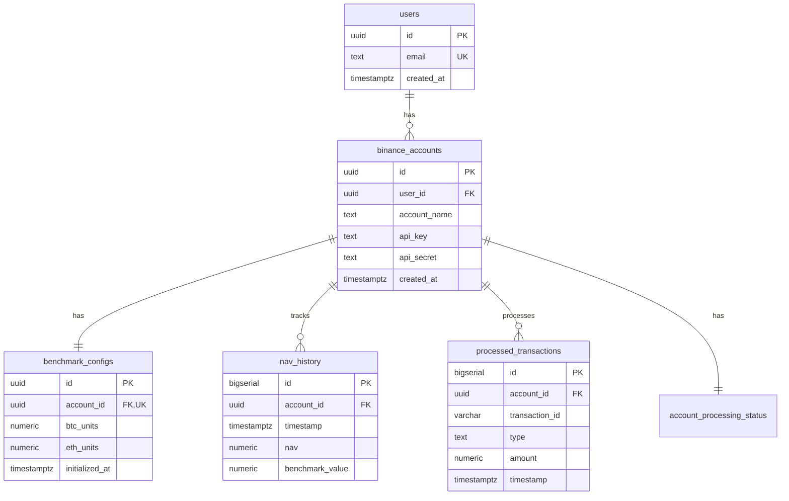

# Database Schema Documentation

This document provides a comprehensive overview of the database schema for the Binance Portfolio Monitor system.

## Overview

The database is hosted on Supabase (PostgreSQL) and consists of 9 main tables that track cryptocurrency trading performance, benchmark comparisons, and system operations.

## Tables

### 1. users
Stores user authentication data.

| Column | Type | Constraints | Description |
|--------|------|-------------|-------------|
| id | UUID | PRIMARY KEY, DEFAULT gen_random_uuid() | Unique user identifier |
| email | TEXT | NOT NULL, UNIQUE | User email address |
| created_at | TIMESTAMPTZ | DEFAULT NOW() | Account creation timestamp |

### 2. binance_accounts
Stores Binance API credentials and account information.

| Column | Type | Constraints | Description |
|--------|------|-------------|-------------|
| id | UUID | PRIMARY KEY, DEFAULT gen_random_uuid() | Unique account identifier |
| user_id | UUID | FOREIGN KEY → users(id) | Reference to user |
| account_name | TEXT | NOT NULL | Display name for the account |
| api_key | TEXT | NOT NULL | Binance API key |
| api_secret | TEXT | NOT NULL | Binance API secret (encrypted) |
| created_at | TIMESTAMPTZ | DEFAULT NOW() | Account creation timestamp |

### 3. benchmark_configs
Tracks BTC/ETH units per account and rebalancing configuration.

| Column | Type | Constraints | Description |
|--------|------|-------------|-------------|
| id | UUID | PRIMARY KEY, DEFAULT gen_random_uuid() | Unique config identifier |
| account_id | UUID | FOREIGN KEY → binance_accounts(id), UNIQUE | One config per account |
| btc_units | NUMERIC | DEFAULT 0 | Current BTC holdings in benchmark |
| eth_units | NUMERIC | DEFAULT 0 | Current ETH holdings in benchmark |
| next_rebalance_timestamp | TIMESTAMPTZ | | Next scheduled rebalance time |
| rebalance_day | INTEGER | NOT NULL, DEFAULT 0 | Day of week for rebalancing (0=Monday) |
| rebalance_hour | INTEGER | NOT NULL, DEFAULT 17 | Hour for rebalancing (UTC) |
| last_transaction_check_timestamp | TIMESTAMPTZ | DEFAULT NOW() | Last transaction check time |
| updated_at | TIMESTAMPTZ | DEFAULT NOW() | Last update timestamp |
| account_name | VARCHAR(255) | | Cached account name |
| last_rebalance_timestamp | TIMESTAMPTZ | | When last rebalancing occurred |
| last_rebalance_status | VARCHAR(20) | CHECK IN ('pending','success','failed','skipped') | Status of last rebalance |
| last_rebalance_error | TEXT | | Error message if rebalance failed |
| rebalance_count | INTEGER | DEFAULT 0 | Total number of rebalances |
| last_rebalance_btc_units | NUMERIC | | BTC units before last rebalance |
| last_rebalance_eth_units | NUMERIC | | ETH units before last rebalance |
| initialized_at | TIMESTAMPTZ | | Benchmark initialization timestamp |

### 4. nav_history
Stores hourly NAV and benchmark values for each account.

| Column | Type | Constraints | Description |
|--------|------|-------------|-------------|
| id | BIGSERIAL | PRIMARY KEY | Auto-incrementing ID |
| account_name | VARCHAR(255) | | Cached account name |
| account_id | UUID | NOT NULL, FOREIGN KEY → binance_accounts(id) | Account reference |
| timestamp | TIMESTAMPTZ | NOT NULL, DEFAULT NOW() | Data collection time |
| nav | NUMERIC | NOT NULL | Net Asset Value in USDT |
| benchmark_value | NUMERIC | NOT NULL | Benchmark value in USDT |
| btc_price | NUMERIC | | BTC price at timestamp |
| eth_price | NUMERIC | | ETH price at timestamp |
| created_at | TIMESTAMPTZ | NOT NULL, DEFAULT NOW() | Record creation time |

**Indexes:**
- idx_nav_history_account_id
- idx_nav_history_timestamp
- idx_nav_history_account_timestamp

### 5. processed_transactions
Tracks all processed deposit/withdrawal transactions.

| Column | Type | Constraints | Description |
|--------|------|-------------|-------------|
| id | BIGSERIAL | PRIMARY KEY | Auto-incrementing ID |
| account_id | UUID | NOT NULL, FOREIGN KEY → binance_accounts(id) | Account reference |
| transaction_id | VARCHAR(50) | NOT NULL | Binance transaction ID |
| type | TEXT | NOT NULL, CHECK IN ('DEPOSIT','WITHDRAWAL','PAY_DEPOSIT','PAY_WITHDRAWAL') | Transaction type |
| amount | NUMERIC(20,8) | NOT NULL | Transaction amount |
| timestamp | TIMESTAMPTZ | NOT NULL | Transaction timestamp |
| status | VARCHAR(20) | NOT NULL | Transaction status |
| metadata | JSONB | | Additional data (transfer_type, tx_id, coin, network) |
| created_at | TIMESTAMPTZ | DEFAULT NOW() | Record creation time |

**Constraints:**
- UNIQUE(account_id, transaction_id) - Prevents duplicate processing

**Indexes:**
- idx_processed_transactions_account_id
- idx_processed_transactions_timestamp
- idx_processed_transactions_transaction_id
- idx_processed_transactions_type

### 6. account_processing_status
Tracks the last processed timestamp for each account.

| Column | Type | Constraints | Description |
|--------|------|-------------|-------------|
| account_id | UUID | PRIMARY KEY, FOREIGN KEY → binance_accounts(id) | Account reference |
| last_processed_timestamp | TIMESTAMPTZ | NOT NULL | Last processed transaction time |
| updated_at | TIMESTAMPTZ | DEFAULT NOW() | Last update time |

**Indexes:**
- idx_account_processing_status_account_id
- idx_account_processing_status_updated_at

### 7. price_history
Historical BTC and ETH prices for benchmark calculations.

| Column | Type | Constraints | Description |
|--------|------|-------------|-------------|
| id | BIGSERIAL | PRIMARY KEY | Auto-incrementing ID |
| timestamp | TIMESTAMPTZ | NOT NULL, DEFAULT NOW() | Price capture time |
| btc_price | NUMERIC(20,8) | NOT NULL | BTC price in USDT |
| eth_price | NUMERIC(20,8) | NOT NULL | ETH price in USDT |
| created_at | TIMESTAMPTZ | DEFAULT NOW() | Record creation time |

**Constraints:**
- UNIQUE(timestamp) - One price per timestamp

**Indexes:**
- idx_price_history_timestamp
- idx_price_history_created_at
- idx_price_history_timestamp_unique

### 8. system_logs
System logs for serverless environments.

| Column | Type | Constraints | Description |
|--------|------|-------------|-------------|
| id | BIGSERIAL | PRIMARY KEY | Auto-incrementing ID |
| timestamp | TIMESTAMPTZ | NOT NULL, DEFAULT NOW() | Log timestamp |
| level | VARCHAR(20) | NOT NULL | Log level (DEBUG, INFO, WARNING, ERROR, CRITICAL) |
| category | VARCHAR(50) | NOT NULL | Log category |
| account_id | TEXT | | Account UUID as text |
| account_name | VARCHAR(255) | | Account name |
| operation | VARCHAR(100) | NOT NULL | Operation being performed |
| message | TEXT | NOT NULL | Log message |
| data | JSONB | | Additional structured data |
| duration_ms | NUMERIC(10,2) | | Operation duration |
| success | BOOLEAN | | Operation success status |
| error | TEXT | | Error message if failed |
| session_id | VARCHAR(100) | NOT NULL | Session identifier |
| created_at | TIMESTAMPTZ | NOT NULL, DEFAULT NOW() | Record creation time |

**Indexes:**
- idx_system_logs_timestamp
- idx_system_logs_level
- idx_system_logs_category
- idx_system_logs_account_id
- idx_system_logs_session_id
- idx_system_logs_created_at
- idx_system_logs_recent (composite: created_at DESC, level, category)

### 9. system_metadata
System-wide configuration and metadata storage.

| Column | Type | Constraints | Description |
|--------|------|-------------|-------------|
| key | VARCHAR(255) | PRIMARY KEY | Metadata key |
| value | TEXT | | Metadata value |
| created_at | TIMESTAMPTZ | DEFAULT CURRENT_TIMESTAMP | Creation time |
| updated_at | TIMESTAMPTZ | DEFAULT CURRENT_TIMESTAMP | Last update time |

## Relationships

## Important Notes

1. **Transaction Types**: The `processed_transactions` table uses the `type` field (not `transaction_type`) with values: DEPOSIT, WITHDRAWAL, PAY_DEPOSIT, PAY_WITHDRAWAL.

2. **Unique Constraints**: The combination of (account_id, transaction_id) in `processed_transactions` prevents duplicate transaction processing.

3. **Benchmark Initialization**: The `initialized_at` timestamp in `benchmark_configs` is used to filter out pre-initialization transactions when processing historical data.

4. **Data Retention**: System logs can be cleaned up using the `cleanup_old_system_logs()` function (currently set to 30 days retention).

5. **Price Data**: The `price_history` table maintains a unique constraint on timestamp to ensure only one price record per time point.

6. **Account Name Caching**: Both `nav_history` and `benchmark_configs` cache the account name for performance and historical consistency.