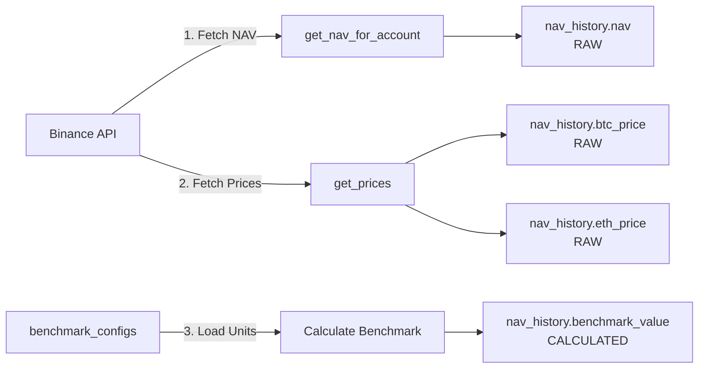
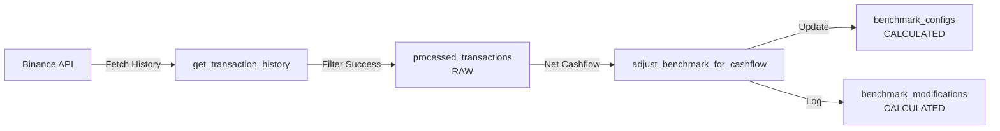
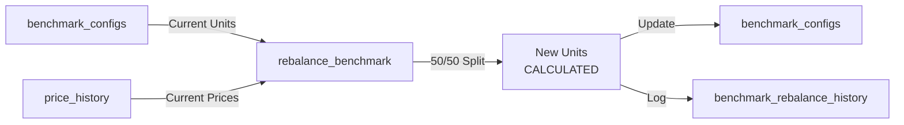

# Data Flow Architecture

## Overview

This document describes how data flows through the system, clearly distinguishing between:
- **RAW**: Data fetched directly from external APIs (Binance)
- **CALCULATED**: Data computed by our system
- **SYSTEM**: Metadata and operational data

## Data Categories

### 🔵 RAW Data (External Sources)

Data that comes directly from Binance API without any modifications:

| Table | Columns | Source |
|-------|---------|--------|
| `price_history` | btc_price, eth_price | Binance public API |
| `processed_transactions` | amount, type, transaction_id, timestamp | Binance account API |
| `nav_history` | nav, btc_price, eth_price | Binance account & public API |

### 🟠 CALCULATED Data (Our Computations)

Data generated by our system's business logic:

| Table | Columns | Calculation |
|-------|---------|-------------|
| `nav_history` | benchmark_value | (btc_units × btc_price) + (eth_units × eth_price) |
| `benchmark_configs` | btc_units, eth_units | Rebalancing algorithm (50/50 split) |
| `benchmark_rebalance_history` | All value columns | Rebalancing calculations |
| `benchmark_modifications` | All unit changes | Deposit/withdrawal impacts |
| `fee_tracking` | All metrics | TWR and fee calculations |

### ⚪ SYSTEM Data (Metadata)

Operational data for system functioning:

| Category | Examples |
|----------|----------|
| Identifiers | account_id, user_id, transaction_id |
| Timestamps | created_at, updated_at |
| Status | status, error messages |
| Configuration | api_key, performance_fee_rate |

## Data Flow Diagrams

### 1. Hourly NAV Snapshot Flow



### 2. Transaction Processing Flow



### 3. Rebalancing Flow



## Key Principles

### 1. Data Immutability
- RAW data is never modified after storage
- Calculations can be re-run from RAW data
- Historical data is append-only

### 2. Separation of Concerns
- API fetching code only deals with RAW data
- Business logic only produces CALCULATED data
- Never mix RAW and CALCULATED in same operation

### 3. Auditability
- Every CALCULATED value can be traced to its RAW inputs
- All calculations are logged with their inputs
- Historical state can be reconstructed

## Implementation Guidelines

### When Adding New Features

1. **New RAW data source?**
   - Create separate table with `_raw` suffix
   - Document the API source
   - Never include calculations

2. **New calculations?**
   - Create separate table/columns for results
   - Log the calculation inputs
   - Make it re-runnable

3. **Mixed data needed?**
   - Use views to combine RAW and CALCULATED
   - Keep source tables separate
   - Document the join logic

### Example: Adding a New Metric

❌ **Wrong Way:**
```sql
ALTER TABLE nav_history ADD COLUMN sharpe_ratio NUMERIC;
-- Mixing calculated data into table with raw data
```

✅ **Right Way:**
```sql
CREATE TABLE performance_metrics (
    account_id UUID,
    timestamp TIMESTAMPTZ,
    sharpe_ratio NUMERIC,  -- CALCULATED
    source_nav_id BIGINT REFERENCES nav_history(id)
);
```

## Future Improvements

### Phase 1: Current State
- Mixed tables with clear documentation
- Manual separation via comments

### Phase 2: Logical Separation
- Views for RAW vs CALCULATED
- Clearer naming conventions
- Automated validation

### Phase 3: Physical Separation
- Separate schemas or databases
- ETL pipelines
- Real-time vs batch processing

## Monitoring Data Quality

### RAW Data Validation
- Check for missing prices
- Validate transaction completeness
- Monitor API response times

### CALCULATED Data Validation
- Verify calculation consistency
- Check for drift over time
- Validate against business rules

## Related Documentation
- `DATABASE_SCHEMA.md` - Complete table structures
- `DATABASE_OVERVIEW.md` - Quick reference guide
- `BENCHMARK_METADATA_IMPROVEMENTS.md` - Audit trail implementation