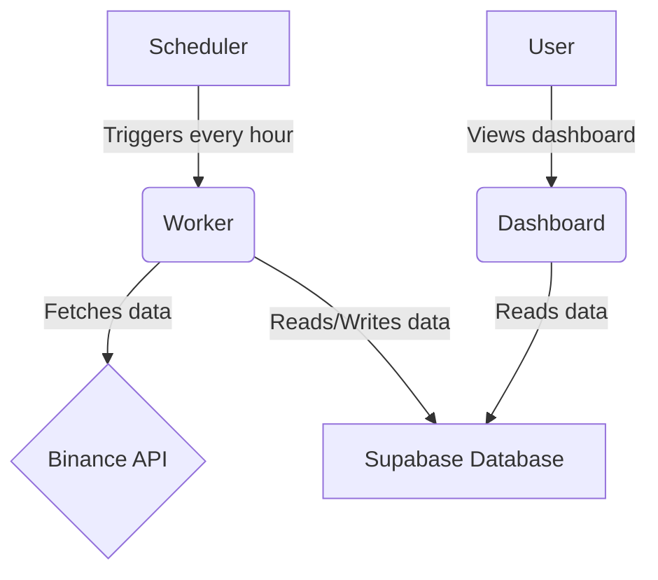

# 🏗️ Architecture

This document describes the architecture of the Binance Portfolio Monitor.

## System Components

The system consists of three main components:

*   **Scheduler (`run_forever.py`)**: A simple Python script that runs the monitoring process at regular intervals.
*   **Worker (`api/index.py`)**: The core of the application. It fetches data from the Binance API, performs calculations, and stores the results in the database.
*   **Dashboard (`api/dashboard.py`)**: A Flask-based web application that displays the collected data in a user-friendly way.

## Architecture Diagram

