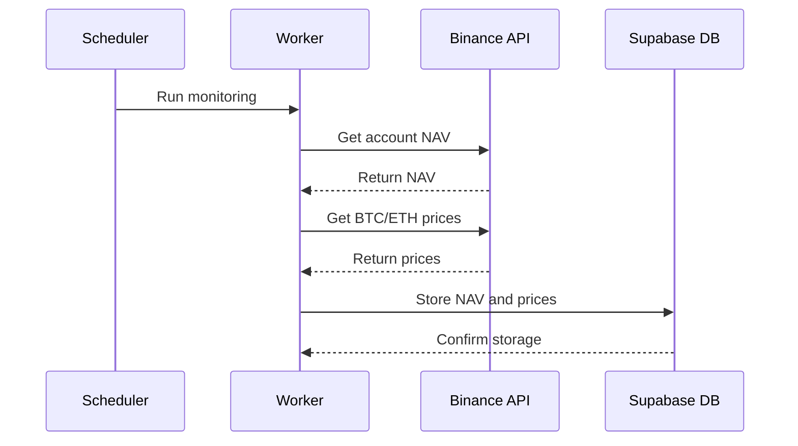

# 🌊 Data Flow

This document describes the data flow within the Binance Portfolio Monitor.

## Data Flow Diagram

```mermaid
sequenceDiagram
    participant Scheduler
    participant Worker
    participant Binance API
    participant Supabase DB

    Scheduler->>Worker: Run monitoring
    Worker->>Binance API: Get account NAV
    Binance API-->>Worker: Return NAV
    Worker->>Binance API: Get BTC/ETH prices
    Binance API-->>Worker: Return prices
    Worker->>Supabase DB: Store NAV and prices
    Supabase DB-->>Worker: Confirm storage
```

